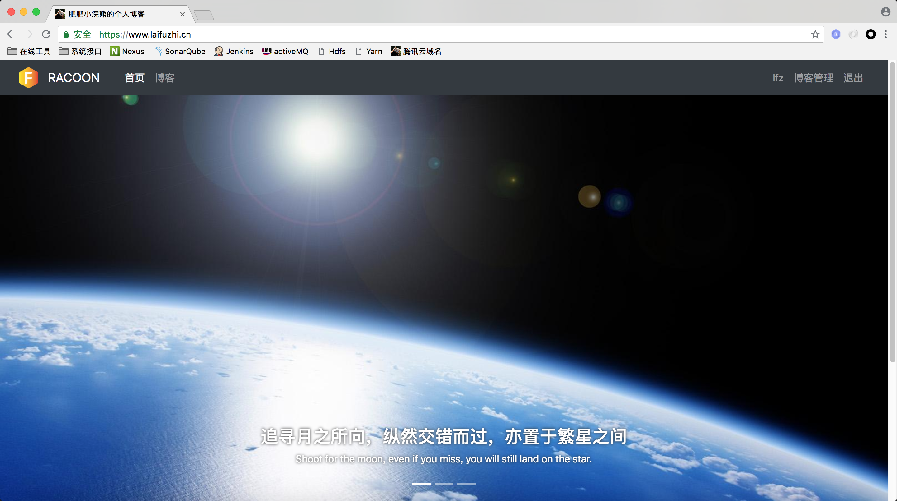
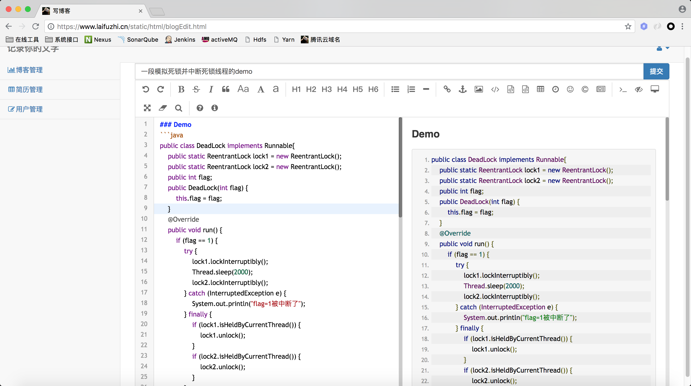
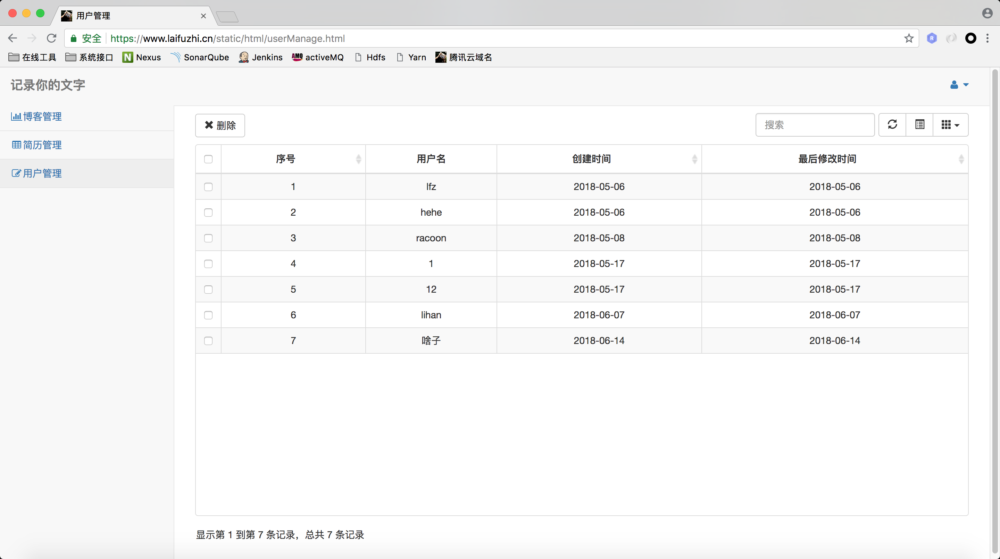
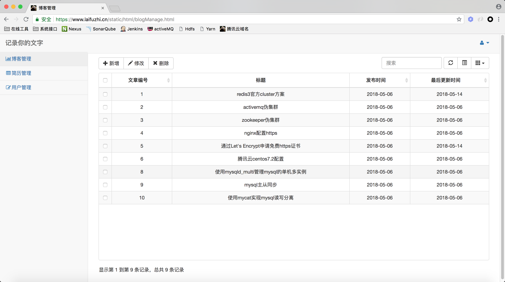

## [MyBlog](https://www.laifuzhi.cn)
#### 最终效果:[https://www.laifuzhi.cn](https://www.laifuzhi.cn)

> 抛弃了实验楼源码的那版，想看那版的小伙伴切换到实验楼分支

> 1. 前端用的[别人的工程](https://github.com/jameszbl/fs-blog)修改(自己前端太渣了)
> 2. 别人的前端基础上，做成前后端分离，nginx动静分离，全站https
> 3. 后端maven构建，依赖lombok插件，ssm的基本框架，没用boot+cloud+gradle这套新玩意
> 4. 服务引入activemq，dubbo，redis
> 5. 权限框架使用shiro，重写使用到的filter，避免返回跳转页面，实现rest服务。使用redis存储session，避免单点
> 6. 整体结构是伪高可用，全部都是单机多实例，1nginx+2tomcat+3activemq+6redis+3zookeeper+1mycat+3mysql的pxc
> 7. 一主一从mysql，使用mycat完成mysql的读写分离，不准备学习使用keepalived(haproxy，lvs)，太偏运维了
> 8. 引入持续集成，github+sonar+jenkins+nexus，pom中有关于nexus的配置
> 9. 使用hadoop分析nginx的日志，统计每篇博客的访问次数(做的比较简陋)

> 注意：暂时只有admin角色的用户可以进入博客管理页，普通注册用户只能看。考虑做成每个注册用户都可以编辑发布博客。
    
> PS:现在在应用层有单点问题，毕竟只有一个nginx，数据层也有单点问题，只有一个mycat，要想解决需要引入haproxy和keepalived，但是太偏运维了，暂时不准备学习

#### 欢迎关注我的[简书](http://www.jianshu.com/u/4c0c1fda9313)，[chinaunix博客](http://blog.chinaunix.net/uid/30592332.html)(2015-2016)

